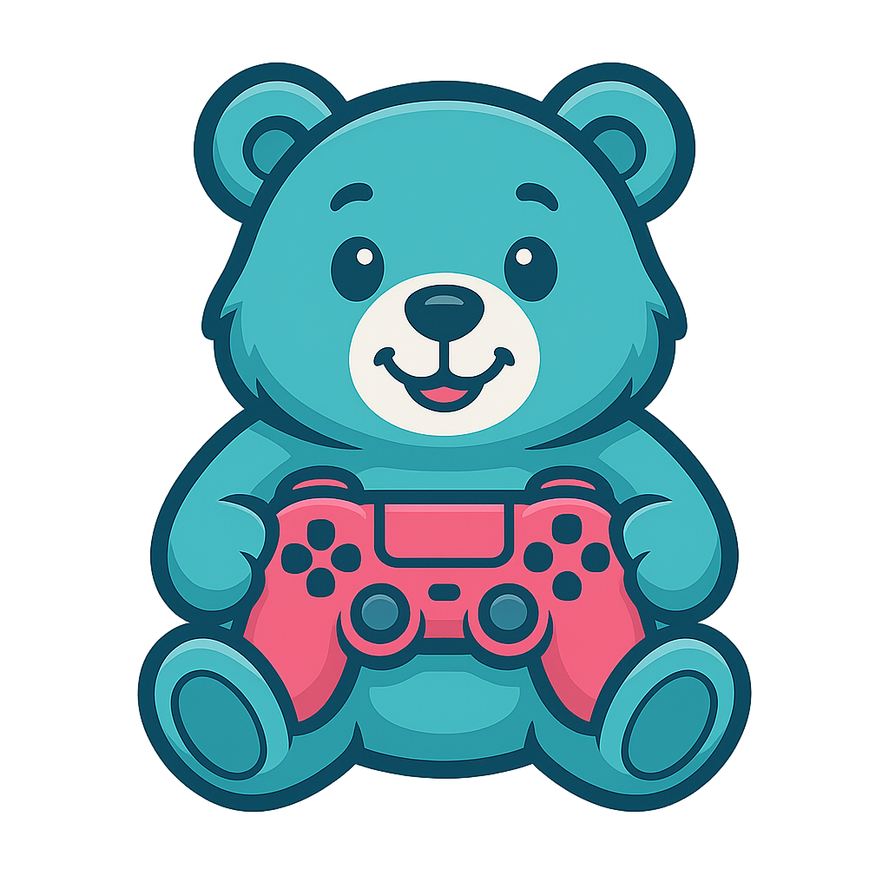

# موقع ألعاب رياض الأطفال 🧸



## نظرة عامة 📚

موقع ألعاب رياض الأطفال هو منصة تعليمية تفاعلية مصممة خصيصًا للأطفال في مرحلة ما قبل المدرسة ورياض الأطفال. يهدف الموقع إلى تعزيز المهارات اللغوية والمعرفية والاجتماعية للأطفال من خلال مجموعة متنوعة من الألعاب التفاعلية.

## الألعاب المتوفرة 🎮

### لعبة الجرس 🔔

لعبة تفاعلية للأطفال تساعد على تحسين سرعة الاستجابة والتركيز. يتنافس فيها لاعبان للضغط على الجرس بسرعة عند ظهور الكلمة أو الصورة.

**ميزات اللعبة:**
- إضافة كلمات مخصصة
- إضافة صور للكلمات
- ضبط توقيت اللعبة
- حفظ وتحميل الألعاب المخصصة
- نظام نقاط تفاعلي
- مؤثرات صوتية وبصرية ممتعة

## المتطلبات التقنية 💻

- خادم ويب (مثل Apache)
- PHP
- متصفح حديث يدعم HTML5 و CSS3 و JavaScript

## طريقة التثبيت ⚙️

1. قم بتنزيل أو استنساخ المستودع إلى مجلد خادم الويب الخاص بك
   ```
   git clone https://github.com/your-username/kggs.git
   ```
2. تأكد من أن خادم الويب الخاص بك يعمل
3. انتقل إلى `http://localhost/kggs` في متصفحك

## هيكل المشروع 📂

```
kggs/
│
├── bell-game.php          # صفحة لعبة الجرس
├── index.php              # الصفحة الرئيسية
│
├── css/                   # ملفات التنسيق
│   ├── bell-game.css      # تنسيق خاص بلعبة الجرس
│   ├── fonts.css          # تعريف الخطوط
│   └── style.css          # تنسيق عام للموقع
│
├── fonts/                 # ملفات الخطوط
│   ├── LuckiestGuy-Regular.ttf
│   └── TintaArabic-Bold.otf
│
├── images/                # الصور
│   └── teddy-bear.png     # شعار الموقع
│
├── js/                    # ملفات جافاسكريبت
│   ├── bell-game.js       # منطق لعبة الجرس
│   └── script.js          # سكريبت عام للموقع
│
└── sounds/                # الملفات الصوتية
    ├── bell.mp3           # صوت الجرس
    └── winner.mp3         # صوت الفائز
```

## كيفية المساهمة 🤝

نرحب بمساهماتكم في تطوير هذا المشروع! إذا كنت ترغب في المساهمة:

1. قم بعمل fork للمشروع
2. أنشئ فرعًا جديدًا لميزتك (`git checkout -b feature/amazing-feature`)
3. قم بإجراء تغييراتك
4. أرسل التغييرات (`git commit -m 'إضافة ميزة رائعة'`)
5. ادفع إلى الفرع (`git push origin feature/amazing-feature`)
6. افتح طلب سحب (Pull Request)

## الإصدارات المستقبلية 🚀

نخطط لإضافة المزيد من الألعاب والميزات في المستقبل:
- ألعاب الحروف والأرقام
- ألعاب الألوان والأشكال
- خيارات تخصيص إضافية
- دعم متعدد اللغات
- نظام تتبع تقدم الطفل

## الترخيص 📝

هذا المشروع مرخص بموجب [الترخيص المناسب] - انظر ملف LICENSE للتفاصيل.

## الاتصال 📞

إذا كان لديك أي أسئلة أو اقتراحات، يرجى التواصل معنا على:
- البريد الإلكتروني: example@example.com
- تويتر: [@KGGamesArabic](https://twitter.com/)
